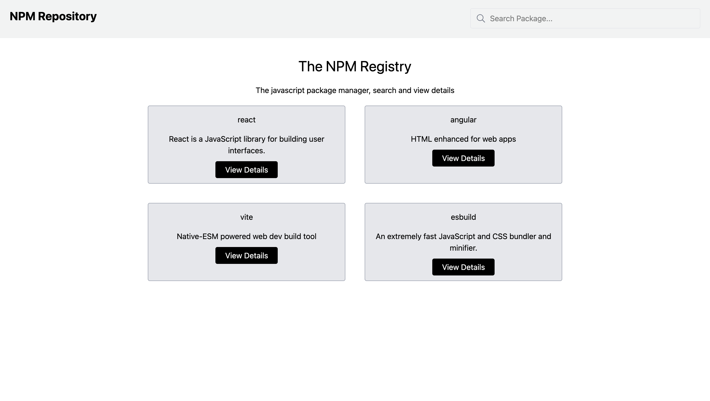
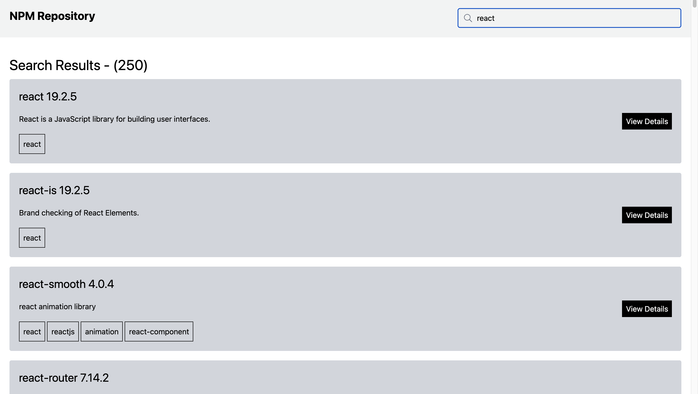
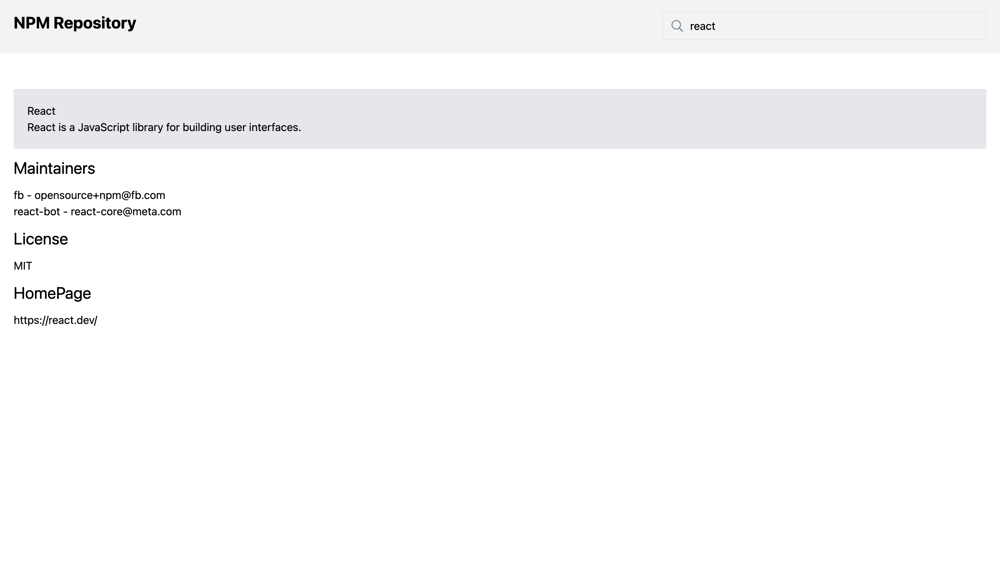

### App Overview

### App Architecture

### App Dependencies
- npm create vite npm-repository -- --template react-ts 
- npm install tailwindcss @tailwindcss/vite
- npm install react-router-dom
- npm install react-icons

### SearchPage
- API (https://registry.npmjs.org/-/v1/search?text=reactjs)
- SearchPackages.ts 
  - interface for API response
  - interface for Simplifying the big response
  - Making an API call to search packages
- searchLoader.ts
  - interface to define the shape of data that loader will return
  - Loader function to fetch search results based on the query parameters in the URL
  - `searchLoader({request}: {request: Request})` is the signature expected by react-router for loader functions, It takes an object with a request property, which is of type Request. This allows us to access the URL and its query parameters.
  - Extracting the search term from the query parameters
- App.tsx
  - Adding the searchLoader function to the route
- SearchPage.tsx
  - `useLoaderData` is a hook provided by react-router that allows us to access the data returned by the loader function associated with the route. 
  - http://localhost:5173/search?term=redux (to test the response)
  - Returning PackageListItem
    - rendering the data with links
        - <Link to ={`/packages/${pkg.name}`}>View Details</Link>
- SearchInput.tsx
  - useNavigate
  - e: React.FormEvent<HTMLFormElement>
    - navigate(`/search?term=${term}`)

### Details Page
- getPackage.ts
  - https://registry.npmjs.org/react
  - interface for API response
  - API call to get the package
- detailsLoader.ts
  - interface for params
  - interface for DetailsLoaderResult
- DetailsPage.tsx
  - rendering the details
### Home Page
- getFeaturedPackages.ts
  - Reusing PackageDetails interface
  - Making multiple API calls parallel with given package names
  - promise.all
- Homepage.tsx
  - displaying the featured products

### How to Start the application
- Clone from github 
- cd npm-repository
- npm install
- npm run dev

### Application Screens

